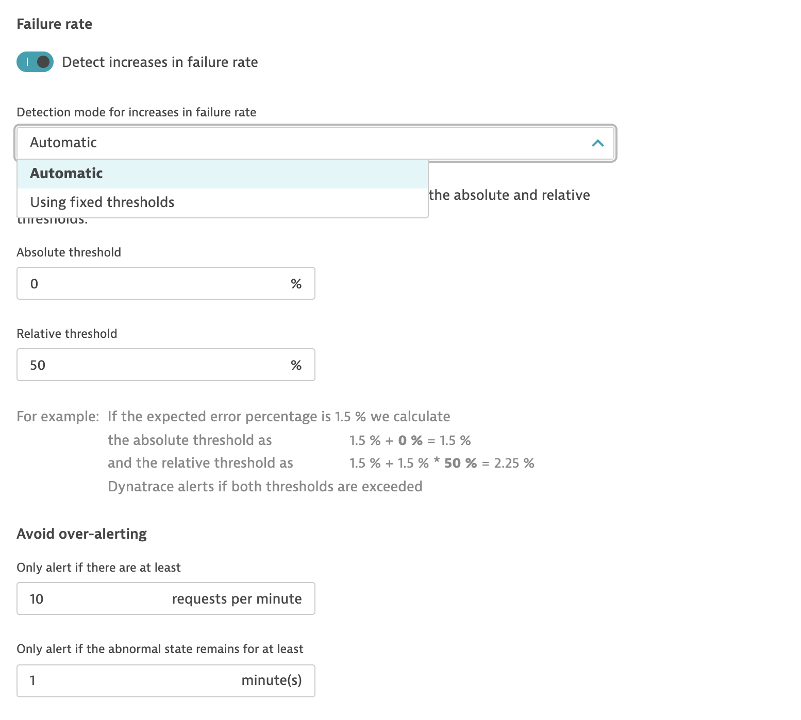
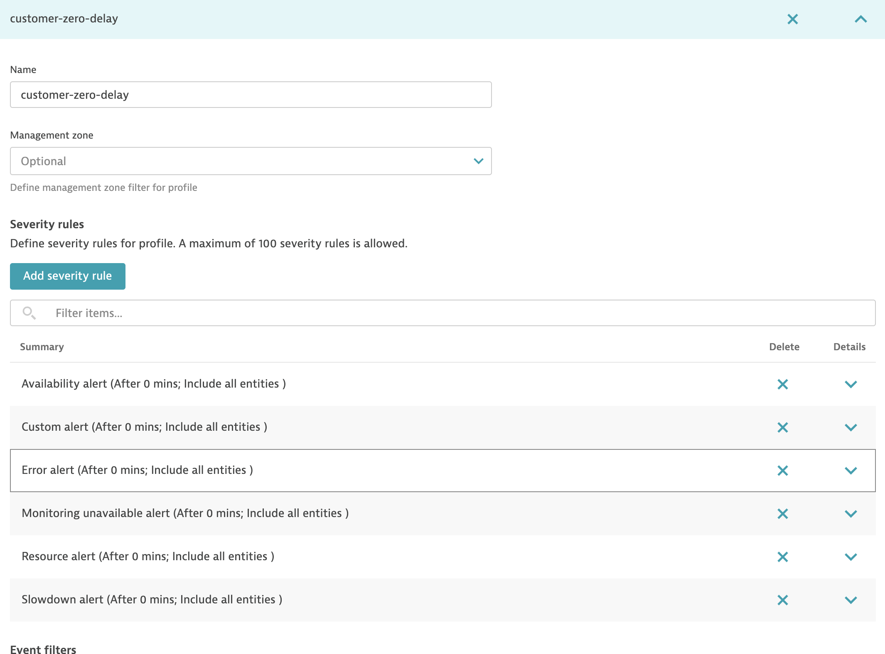

## What Dynatrace offers?

In regards to failure rate, Dynatrace offers quite a bit of functionality.

Here is a quick summary with relevant screenshots

- Can be configured to show anomalies in failure rate - increase or decrease

- Thresholds for alerting can be set to automatic or configured manually.

- Dynatrace also provides the root cause of increase in failure in most cases like 404 error, etc.

- Further Dynatrace can be configured to go deeper into the callstacks within each service calls and failure rates can be configured for endpoints which are more important for business.

- Dynatrace can be configured to alert immediately after an anomaly in failure rate.

- Although the code for dynatrace's anomaly engine (AI engine Davis) is not public but I am quite certain that it uses declarative rule based approach(reactive) to find anomalies in failure rate.

- Time duration/window and minimum number of calls etc. can be set for the calculations.

## What improvements we can try to offer?

- Currently there are a lot of false positives(not exactly false positives but redundant alerts) in our channels. This can be tackled in following ways
    - Configure dynatrace alerting profile to trigger alert for higher threshold -> This can eliminate lots of redundant alerts.
    - Or use our own Ml algorithm to dynamically select threshold --> See if we can offer better and more relvant results? Better accuracy etc.?

- Tweak failure rate calculations to show more relevant metric for developers and business?

- Further narrowing down failure rates to sub calls/modules  for quicker and deeper RCA.

- We have configured in alerting profiles to alert immediately in channels like slack after an anomaly but as dynatrace follows declarative approach, I have noticed that alerts show in slack after 3-10 minutes(typically 5 mins) after the actual incident occurrence. We can do some significant improvements here:
    - Follow proactive approach of alerting - immediately alert after the incident.
    - Meet SLAs (reduce time to react)

- Dynatrace can do alerting which then require manual inspection of SRE and developers to resolve an incident. If we have good accuracy(or relevant KPI), we can further :
    - We can perform some actions like increase/decrease resources
    - Invoke K8s api server to trigger relevant actions. 
    - Trigger rollbacks etc. depending on the incident.
    - And if we go super super ambitious - we can trigger automatic code correction :D 

